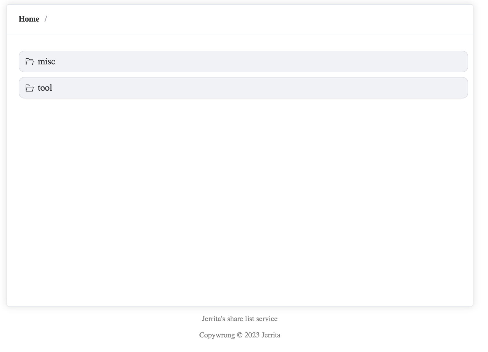

# fls-worker

This is a simple file list service based on cloudflare pages、functions and R2

Example site: https://fls.tisato.live

Just for exploring the usage of cloudflare pages functions.

## Usage

- Clone this project
- Edit `src/tools.js`
- `yarn build`
- Setup your R2 on cloudflare
- `wrangler pages publish dist`

## Features

- If your file/dir starts with `.`, it will not be shown in the fls.